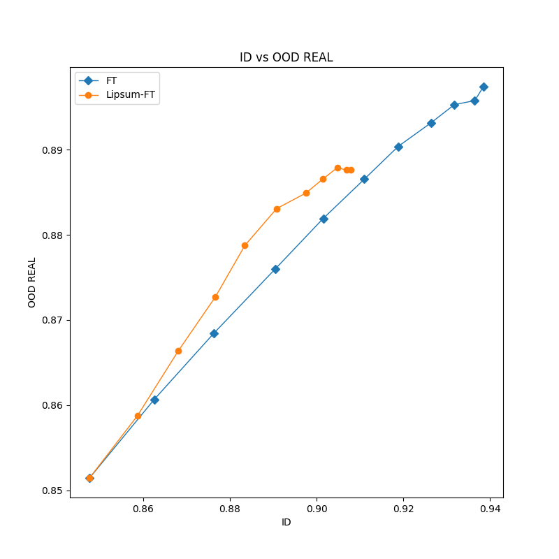
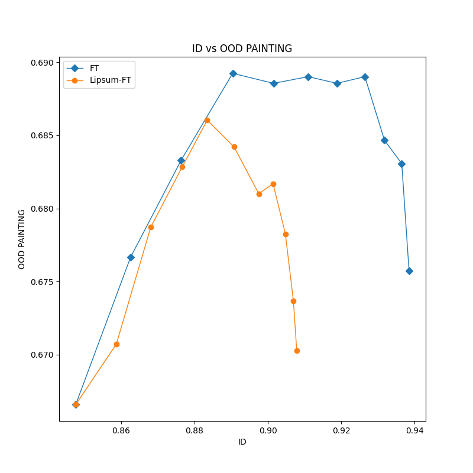
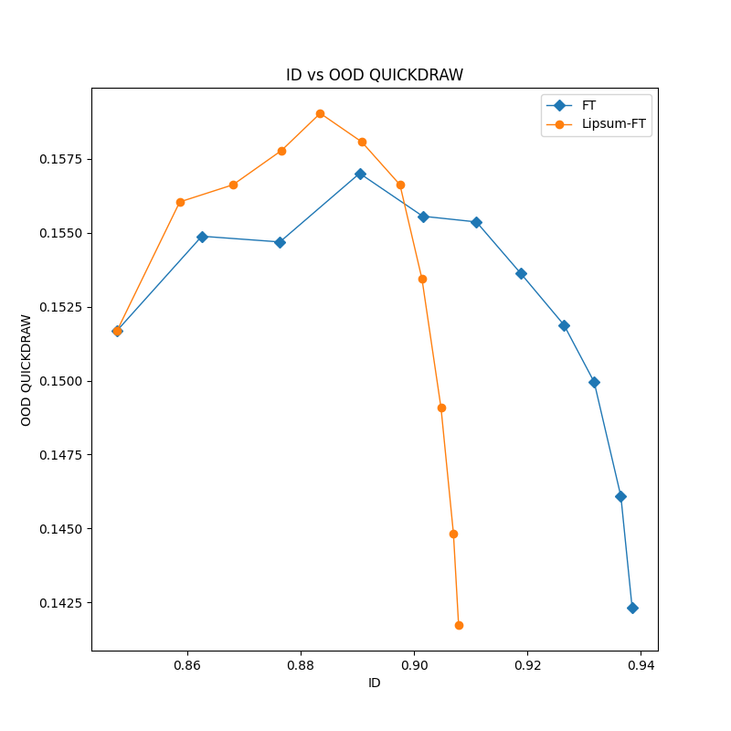
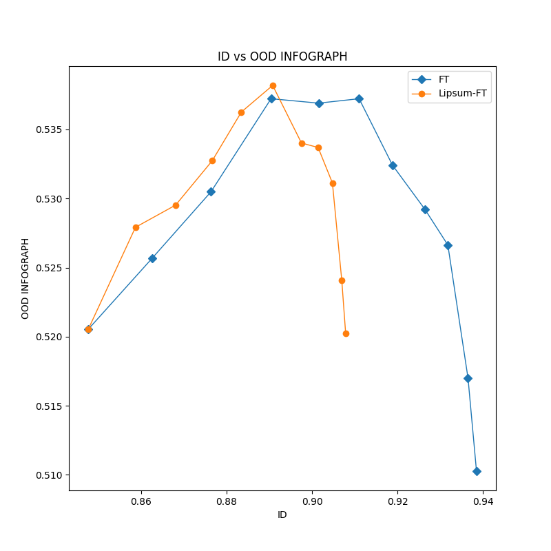

## How to run the code

```
uv sync
source .venv/bin/activate
python full_finetuning.py --fraction 1.0
python lipsum_finetuning.py --fraction 1.0
python evaluate_all.py --fraction 0.1
python plot_fronts.py
```

## Results

JSON files with metrics are in the `results` directory.


Plots of ID vs OOD are in the `fronts` directory:






## How to fix torch errors on Constructor GPU
```
export PATH="/home/coder/project/dl/.venv/bin:$PATH"
hash -r
unset PYTHONPATH
```