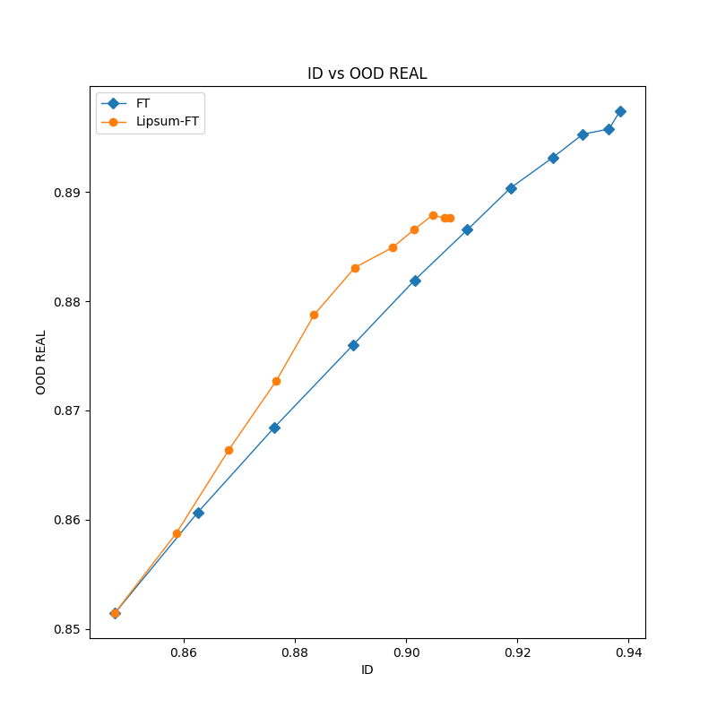
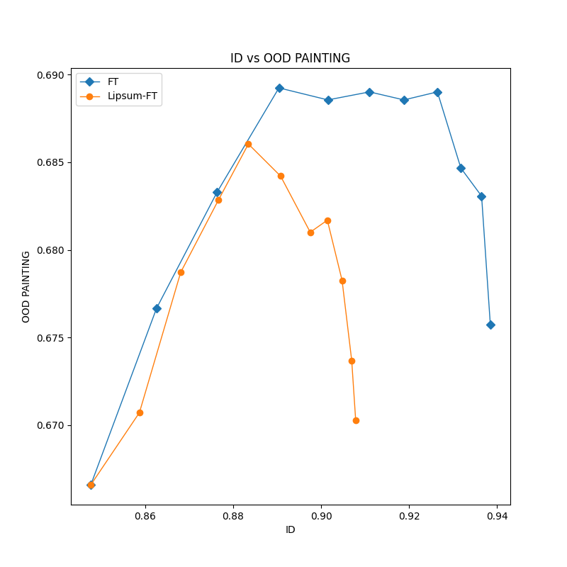
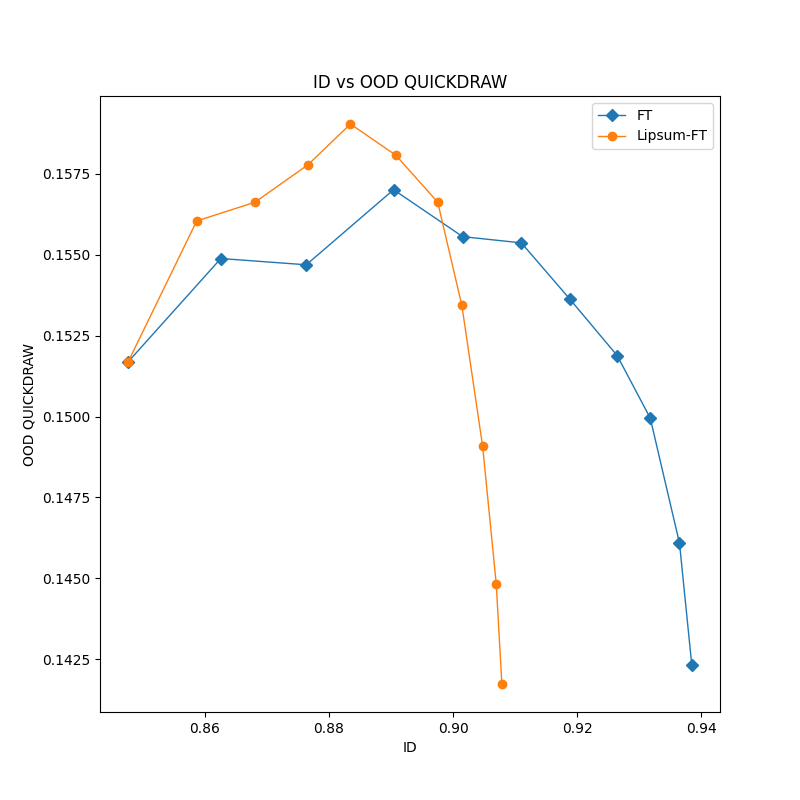
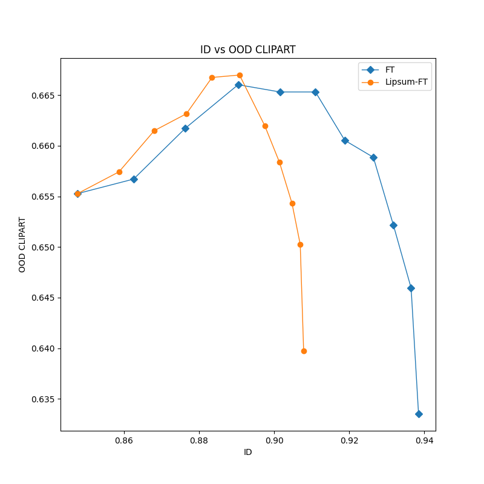
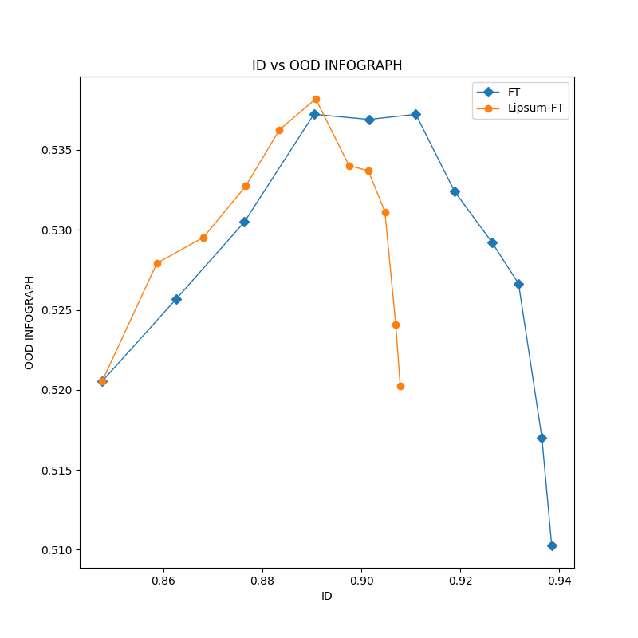

## How to run the code

```
uv sync
source .venv/bin/activate
python full_finetuning.py --fraction 1.0
python lipsum_finetuning.py --fraction 1.0
python evaluate_all.py --fraction 0.1
python plot_fronts.py
```

## Results

JSON files with metrics are in the `results` directory.


Plots of ID vs OOD are in the `fronts` directory:






## How to fix torch errors on Constructor GPU
```
export PATH="/home/coder/project/dl/.venv/bin:$PATH"
hash -r
unset PYTHONPATH
```

Supervised: https://wandb.ai/mlxa/stl10-resnet18/runs/stdcr639?nw=nwusermlxa
SimCLR: https://wandb.ai/mlxa/stl10-simclr/runs/gufwj19u?nw=nwusermlxa
BYOL: https://wandb.ai/mlxa/stl10-byol/runs/88rswg7k?nw=nwusermlxa
SimCLR finetune: https://wandb.ai/mlxa/stl10-resnet18-finetune/runs/oucrugh8?nw=nwusermlxa
BYOL finetune: https://wandb.ai/mlxa/stl10-resnet18-finetune/runs/2ji1oqff

Step 6: OOD evaluation on CIFAR-10...
Supervised:
Loading model from checkpoints/supervised.ckpt

OOD Accuracy on CIFAR-10: 0.2330 (23.30%)

SimCLR (linear probe):
Loading model from checkpoints/simclr-best-epoch=65-test_logreg_acc=0.6696.ckpt

OOD Accuracy on CIFAR-10: 0.5199 (51.99%)

SimCLR (fine-tuned):
Loading model from checkpoints/simclr-finetuned.ckpt

OOD Accuracy on CIFAR-10: 0.3351 (33.51%)

BYOL (linear probe):
Loading model from checkpoints/byol-best-epoch=56-test_logreg_acc=0.4341.ckpt

OOD Accuracy on CIFAR-10: 0.2989 (29.89%)

BYOL (fine-tuned):
Loading model from checkpoints/byol-finetuned.ckpt
